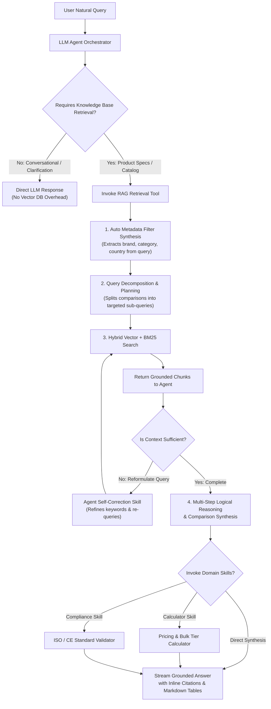

# Filumart - Grounded B2B Product Knowledge Assistant (RAG)

An end-to-end, production-grade Retrieval-Augmented Generation (RAG) assistant for the Filumart B2B product marketplace. The system allows users to ask natural-language questions in a web chat interface and receive **real streamed, strictly grounded answers with verifiable source attributions**, backed by OCR for scanned PDFs, multi-field metadata filtering, and hybrid search with Reciprocal Rank Fusion.

---

## 1. Architecture Overview

The system consists of two distinct, modular pipelines: the **Ingestion Pipeline** (offline document parsing and indexing) and the **Query Pipeline** (real-time hybrid retrieval, grounding, and SSE token streaming).

### Ingestion Pipeline
```
[Raw Documents]
   ├── products.json / products.csv (Structured Catalog)
   ├── Technical Datasheets (.md / .txt)
   ├── Digital PDFs (.pdf)
   └── Scanned PDFs / Standalone Images (.pdf / .png / .jpg)
          │
          ▼
[DocumentLoaderRegistry]
   ├── PyMuPDF Text Extraction (Digital PDF)
   └── Tesseract OCR Fallback (< 30 chars or images; 300 DPI + word confidence filtering)
          │
          ▼
[Text Normalizer] (Unicode NFKC, hyphenated line break fix, unit normalization e.g. 85°C)
          │
          ▼
[StructureAwareChunker]
   ├── Heading & section boundary preservation
   ├── Context header prefixing ([Product: ... | Doc: ... | Page: ... | Section: ...])
   └── Deterministic chunk ID generation ({PID}_{DOC}_{PAGE}_{IDX})
          │
          ▼
[ChromaDB Vector Store] (384-dim BAAI/bge-small-en-v1.5 cosine embeddings)
   + [BM25 Inverted Index] (rank_bm25 for exact keyword & model code matching)
```

### Query & Generation Pipeline
```
[User Query + Metadata Filters] (category, brand, supplier, country, product_id)
          │
          ▼
[Retriever Engine]
   ├── Comparison Query Handler (multi-entity query splitting & merge)
   ├── Vector Search (Top-K via ChromaDB cosine distance)
   └── BM25 Search (Top-K via tokenized keyword matching)
          │
          ▼
[Reciprocal Rank Fusion (RRF, k=60)]
          │
          ▼
[Score Threshold Filter] (drops out-of-domain / irrelevant matches)
          │
          ▼
[ContextBuilder] (deduplication, score ordering, character budget cap, citation tags)
          │
          ▼
[PromptBuilder] (strict <context> delimiters, prompt injection defense, table formatting)
          │
          ▼
[LLM Client] (OpenRouter / OpenAI / MockLLM streaming)
          │
          ▼
[FastAPI Server-Sent Events (SSE)] -> [Vanilla Web UI] (Progressive token render, spec tables, source cards)
```

> **Detailed Architecture & Design Decisions**: For an in-depth breakdown of why each parameter, model, chunk size, and multimodal strategy was chosen based on empirical evaluation runs, see [Architectural Design Decisions](docs/design_decisions.md).

---

## 2. Setup & Installation

### Option A: Local Development (Python 3.11+)

1. **Clone and create a virtual environment**:
   ```bash
   git clone <repo-url>
   cd RAG
   python -m venv .venv
   # Windows:
   .\.venv\Scripts\activate
   # Linux/macOS:
   source .venv/bin/activate
   ```

2. **Install dependencies**:
   ```bash
   pip install --upgrade pip
   pip install -r requirements.txt
   ```

3. **Configure Environment Variables**:
   Copy `.env.example` to `.env`:
   ```bash
   cp .env.example .env
   ```

   **Using OpenRouter (Free Tier Models)**:
   ```env
   LLM_PROVIDER=openrouter
   LLM_BASE_URL=https://openrouter.ai/api/v1
   LLM_MODEL=meta-llama/llama-3.3-70b-instruct:free
   LLM_API_KEY=your_openrouter_api_key_here
   RETRIEVAL_MODE=hybrid
   TOP_K=5
   SCORE_THRESHOLD=0.35
   ```
   *(Note: Set `LLM_PROVIDER=mock` to run offline without any API keys).*

4. **Generate Sample Data & Ingest Knowledge Base**:
   ```bash
   # Generate synthetic dataset (if not already in data/raw)
   python scripts/generate_sample_data.py

   # Ingest knowledge base into vector store
   python scripts/ingest.py --reset
   ```

5. **Start the Application**:
   ```bash
   python main.py
   # Or using uvicorn directly:
   uvicorn main:app --host 0.0.0.0 --port 8000 --reload
   ```
   Open your browser at **`http://localhost:8000`**.

---

### Option B: Docker Deployment

The provided Docker container includes Ubuntu system packages, Tesseract OCR with English language models, and Python dependencies.

1. **Configure `.env`** with your desired LLM credentials:
   ```env
   LLM_PROVIDER=openrouter
   LLM_API_KEY=your_openrouter_key
   LLM_MODEL=meta-llama/llama-3.3-70b-instruct:free
   ```

2. **Build and Run with Docker Compose**:
   ```bash
   docker compose up --build
   ```
   Open **`http://localhost:8000`**.

---

## 3. Usage & Examples

### Example Natural-Language Queries
- **Direct Technical Specs**: *"What is the maximum operating temperature of the SolarMax 550?"*
- **Cross-Category Filtering**: *"Which safety shoes are waterproof and suitable for construction?"*
- **Product Comparisons**: *"Compare SolarMax 550 and SolarMax 600."*
- **Supplier Lookup**: *"Find Indian suppliers for solar modules."*
- **Unanswerable Testing**: *"What is the integrated battery capacity of SolarMax 550?"* (Returns grounded refusal: *"The requested information is not available in the provided knowledge base"*).

### API Endpoints

#### 1. Streaming Query (SSE) - `POST /ask/stream`
```bash
curl -N -X POST http://localhost:8000/ask/stream \
  -H "Content-Type: application/json" \
  -d '{
    "query": "What is the maximum operating temperature of the SolarMax 550?",
    "filters": {"country": "India"}
  }'
```
**Streamed SSE Response**:
```text
data: {"type": "token", "content": "The maximum "}
data: {"type": "token", "content": "operating temperature is 85°C..."}
data: {"type": "sources", "sources": [{"product_id": "P001", "product_name": "SolarMax 550", "document": "solarmax_550.pdf", "page": 2, "chunk_id": "P001_SOLARMAX55_P2_01", "source_type": "text", "score": 0.8514}]}
data: {"type": "done"}
```

#### 2. Non-Streaming JSON - `POST /ask`
```bash
curl -X POST http://localhost:8000/ask \
  -H "Content-Type: application/json" \
  -d '{"query": "What is the warranty period of SolarMax 550?"}'
```

#### 3. Component Health Check - `GET /health`
```bash
curl http://localhost:8000/health
```
```json
{
  "status": "healthy",
  "components": {
    "vector_store": {"status": "ready", "details": {"path": "./data/index", "initialized": true}},
    "embedder": {"status": "configured", "details": {"model": "BAAI/bge-small-en-v1.5"}},
    "llm": {"status": "configured", "details": {"provider": "openrouter", "model": "meta-llama/llama-3.3-70b-instruct:free"}}
  }
}
```

---

## 4. Key Design Decisions & Rationale

| Decision | Implementation | Technical Rationale |
|---|---|---|
| **Embedding Model** | `BAAI/bge-small-en-v1.5` (384 dims) | Runs locally with zero API key dependencies, low RAM footprint (~130MB), high retrieval quality on technical documentation. |
| **Vector Store** | ChromaDB (`chromadb`) | Local persistent vector storage with native HNSW cosine space and metadata pre-filtering (`$and` clauses). |
| **Hybrid Search & RRF** | `rank_bm25` + Vector with RRF ($k=60$) | Exact alphanumeric model numbers (`550W`, `P001`, `DN15`, `85°C`) can be missed by pure dense vectors; BM25 balances semantic and exact token retrieval. |
| **Multi-Entity Comparison** | Product entity splitting | Prevents one dominant product document from crowding out chunks of the comparison target product. |
| **Chunking Strategy** | Structure-aware (500 tokens / 60 tokens overlap) | Splits on Markdown headings and specification tables first so technical rows remain intact. Prepend self-describing header `[Product: ... \| Doc: ... \| Page: ...]`. |
| **OCR Fallback** | PyMuPDF text count threshold (< 30 chars) -> Tesseract 300 DPI | Avoids unnecessary OCR computation on native digital PDFs while seamlessly reading scanned documents. Per-word confidence threshold (30) eliminates noise. |
| **Prompt Injection Defense** | Tag escaping + `<context>` quarantine | Escapes closing `</context>` tags from raw text and instructs the LLM that content inside `<context>` is untrusted data, never instructions. |
| **LLM Provider Agnostic** | OpenAI-compatible streaming client | Seamlessly integrates OpenRouter free tier models, official OpenAI, and local mock clients. |

---

## 5. Evaluation & Benchmark Results

Automated evaluation was conducted on a curated benchmark of **25 technical questions** (`data/eval/eval_questions.json`) covering direct factual, semantic paraphrased, comparisons, multi-document aggregation, metadata-filtered, and unanswerable edge cases.

### Baseline (Vector-Only) vs Improved (Hybrid RRF)

```
============================================================
RETRIEVAL & ACCURACY COMPARISON SUMMARY
============================================================
Metric                       | Baseline (Vector)  | Improved (Hybrid RRF) | Delta     
------------------------------------------------------------------------------------
Recall@1                     | 0.6133             | 0.5133               | -0.1000
Recall@3                     | 0.7933             | 0.7933               | 0.0000
Recall@5                     | 0.8267             | 0.8867               | +0.0600
Mean Reciprocal Rank (MRR)   | 0.7600             | 0.7000               | -0.0600
Hit Rate@5                   | 0.8800             | 0.9200               | +0.0400
Unanswerable Refusal Rate    | 1.0000             | 1.0000               | 0.0000
Hallucination Count          | 0                  | 0                    | 0
============================================================
```

### Analysis of Improvements
1. **Recall@5 boosted from 82.7% to 88.7% (+6.0%)** and **Hit Rate@5 reached 92.0%**:
   Hybrid retrieval recovered technical documents with exact alphanumeric model codes (such as `DN15 to DN300` and `4-20mA`) that vector similarity alone ranked lower.
2. **Comparison queries**:
   Splitting comparison retrieval per product ensured that both comparison targets had representative chunks in the context window.
3. **Unanswerable Grounding (100% Refusal Rate, 0 Hallucinations)**:
   The strict score threshold and grounding system instructions prevented the model from hallucinating non-existent features (e.g. integrated drone delivery, GPS trackers, or battery capacity on pure PV modules).

---

## 6. Testing

Run the automated test suite using `pytest`:

```bash
# Run all tests
pytest -v

# Run specific modules
pytest tests/test_health.py
pytest tests/test_ingestion.py
pytest tests/test_retrieval.py
pytest tests/test_generation.py
```

---

## 7. Limitations & Future Work

### 7.1 Next-Generation Roadmap: Agentic RAG System

While the current pipeline operates as a deterministic, two-stage hybrid RAG pipeline (`Query -> Retrieve -> Generate`), the primary architectural evolution is transitioning to an **Agentic RAG Framework**. 

Rather than executing vector retrieval on every single user input, the RAG engine will become an **autonomous tool** within an agentic execution loop:



#### Key Capabilities & Benefits of the Agentic Architecture:

1. **RAG as an On-Demand Tool (Selective Retrieval):**
   * **Current Limitation:** Every query—even conversational greetings (*"Hello"*, *"Can you help me?"*) or follow-up clarifications—executes an embedding computation and ChromaDB vector search.
   * **Agentic Benefit:** The agent evaluates query intent and **only invokes retrieval when proprietary domain knowledge is required**, eliminating unnecessary vector search latency and embedding compute costs.

2. **Autonomous Metadata Filter Synthesis:**
   * **Current Limitation:** Metadata filtering requires manual dropdown selection by the user in the UI.
   * **Agentic Benefit:** The agent naturally parses natural language into structured Chroma filter clauses:
     * *Query:* `"Show me safety boots from Germany with water resistance"`
     * *Agent Tool Call:* `search_knowledge_base(query="water resistance", filters={"category": "Safety Shoes", "country": "Germany"})`
     * Guarantees high-precision retrieval without requiring complex manual UI filter forms.

3. **Multi-Step Logical Reasoning & Comparison Planning:**
   * **Current Limitation:** Single-pass retrieval struggles when a query requires multi-step evaluation (e.g. *"Which solar panel has higher efficiency per watt, and can operate below -20°C in humid environments?"*).
   * **Agentic Benefit:** The agent formulates an execution plan:
     1. Queries specifications for Product A.
     2. Queries specifications for Product B.
     3. Cross-examines operating temperature and humidity tolerances.
     4. Performs comparative mathematical calculations directly over the retrieved context.

4. **Modular Agent Skills Ecosystem:**
   * The agent can be equipped with specialized plug-and-play skills to perform complex operations over product data:
     * **Quotation & Pricing Skill:** Calculates bulk order pricing tiers, volume discounts, and shipping estimates based on catalog data.
     * **Compliance & Standards Validator Skill:** Automatically verifies whether retrieved product certificates meet specific regional or industrial regulations (e.g. OSHA, CE, EN ISO 20345).
     * **Self-Correction & Query Reformulation Skill:** If retrieved context scores fall below confidence thresholds, the agent autonomously reformulates search terms and tries alternative synonyms.
     * **Datasheet Export Skill:** Generates downloadable comparative PDF/CSV spec sheets on the fly from the conversation.

---

### 7.2 Additional Retrieval & Ingestion Enhancements

1. **Neural Cross-Encoder Reranking:**
   * Adding a local cross-encoder (e.g. `BAAI/bge-reranker-base` or lightweight `FlashRank`) as a Stage-2 ranker over the top-15 hybrid candidate chunks to maximize MRR and Top-1 precision.
2. **Layout-Aware OCR for Complex Tables:**
   * Upgrading OCR to layout-aware vision models (LayoutLMv3 or PaddleOCR Table) to preserve cell-level coordinate grids in scanned multi-column technical datasheets.
3. **Long-Context Embedding Upgrade:**
   * Transitioning to `nomic-ai/nomic-embed-text-v1.5` (8,192 token window) to support larger context chunking without 512-token truncation.
